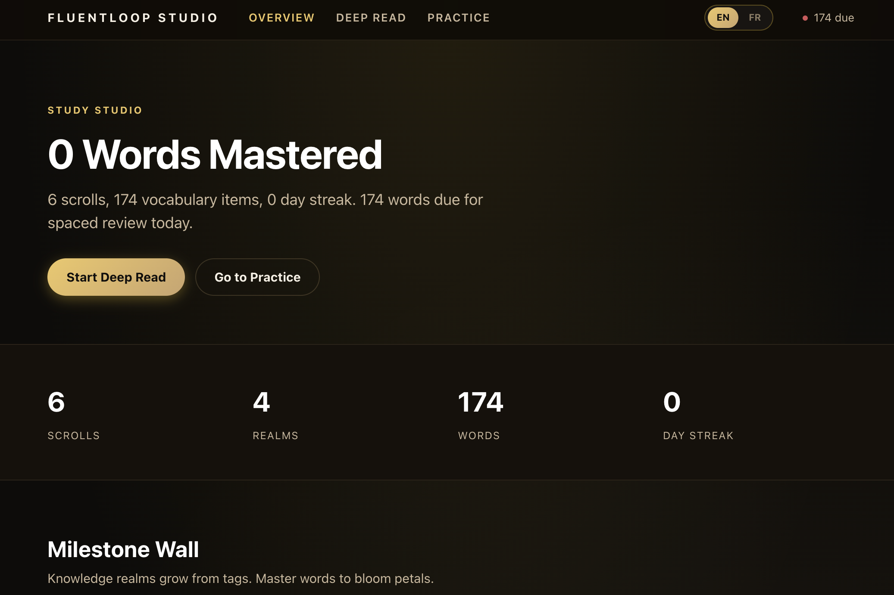
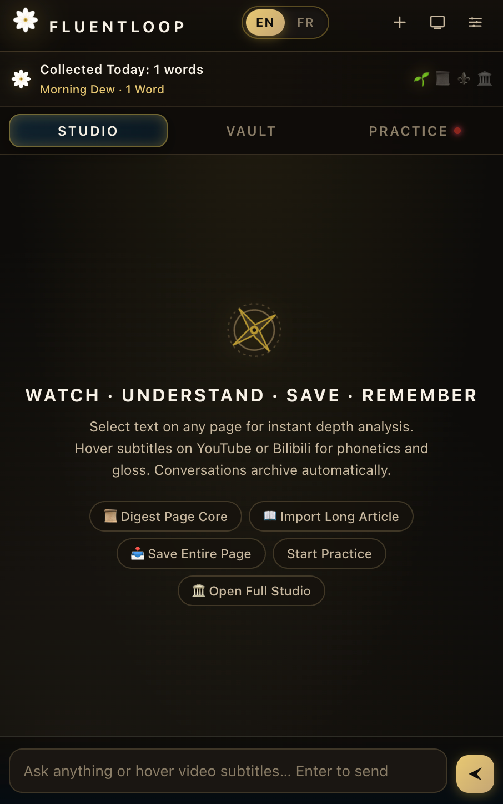
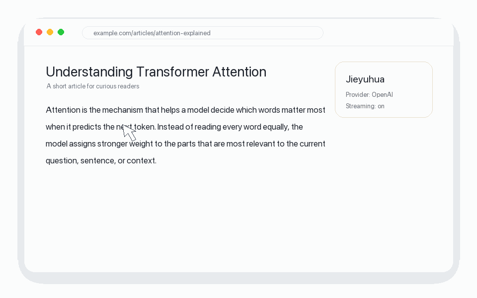
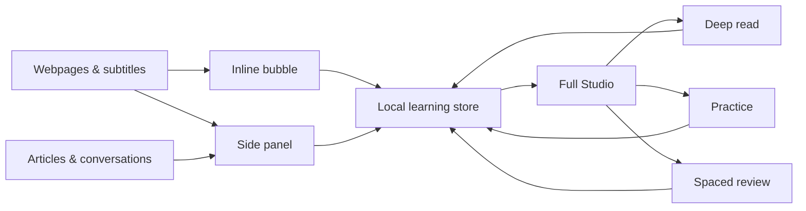

# FluentLoop

**Turn the things you read and watch into a personal language-learning loop.**


[](./LICENSE)
[](https://developer.chrome.com/docs/extensions/develop/migrate/what-is-mv3)
[](#install-from-source)
[](./PRIVACY.md)

FluentLoop is a local-first Chrome extension for learning English and French in context. It captures words, subtitles, articles, and conversations; turns them into explanations and study material; and brings them back through quizzes and spaced repetition.

It began as **Jieyuhua**, a small inline text explainer. I kept using it, noticing what was missing, and adding the next useful step. The result is no longer just an explanation bubble—it is a learning system built around a simple loop:

```text
Encounter something
        ↓
Understand it in context
        ↓
Save what matters
        ↓
Practise and review
        ↓
Meet it again with better understanding
```

## Product Tour

<table>
  <tr>
    <td width="64%" valign="top">
      <br>
      <sub><b>Full Studio</b> — deep reading, vocabulary, knowledge realms, practice, and spaced review.</sub>
    </td>
    <td width="36%" valign="top">
      <br>
      <sub><b>Side Panel</b> — quick chat, shelf, capture, practice, and model settings.</sub>
    </td>
  </tr>
</table>

### Inline explanations

Select text on a webpage—or hover over YouTube and Bilibili subtitles—to get a short contextual explanation without leaving what you are reading or watching.



### A shelf that becomes a curriculum

Save an article or conversation and FluentLoop extracts useful vocabulary, concepts, contextual examples, and tags. The tags become knowledge realms automatically, so the structure grows from what you actually read rather than from a preset course.

### Practice that comes back at the right time

Saved material becomes cloze questions, translation, sentence writing, contextual meaning, grammar or conjugation practice, and SM-2 review cards. English and French have separate stores, prompts, voices, and review queues.

## Three Surfaces, One Learning Store



- **Inline bubble:** understand a word, phrase, or subtitle in place.
- **Side panel:** ask follow-up questions, capture material, browse the shelf, and practise.
- **Full Studio:** work through deep reads, exams, vocabulary realms, notes, and scheduled review.
- **Shared local store:** all three surfaces use the same `chrome.storage.local` data—no account or project-owned backend.

Read the detailed [architecture notes](./docs/architecture.md).

## Product Decisions

### Short by default, deeper on demand

An inline explanation should preserve reading flow. FluentLoop starts with an accurate translation and a small number of useful terms; the longer explanation is available when the learner asks for it.

### Context before vocabulary lists

The same word can mean something different in a financial article, a product tutorial, or a video interview. Explanations, tags, and questions are generated from the surrounding material instead of forcing everything into one subject.

### Local-first until a backend earns its place

API keys, saved material, notes, and review state stay in the browser profile. This keeps the tool small and understandable. The trade-off is explicit: data does not automatically sync across devices.

### AI generates; code checks

Where possible, deterministic checks sit after model output. For example, multiple-choice questions are verified so the correct answer actually exists among the options. The model helps create material; it does not get the last word on basic validity.

## How It Was Built

FluentLoop is a personal product and an AI-assisted coding project.

I defined the learning problem, product direction, feature requirements, interaction decisions, and iteration priorities. AI coding tools handled much of the implementation. I tested the extension through my own learning workflow, identified where the experience broke down, and kept refining the behavior.

That division of work is intentional: the value of the project is not a claim that every line was typed by hand. It is the process of turning a recurring personal problem into a working system, using it, and making it more coherent over time.

## Features

- Contextual explanations for selected text and video subtitles
- Streaming responses from a user-selected AI provider
- Click-to-hear pronunciation with English and French voices
- Article and conversation capture
- Auto-generated vocabulary, concepts, tags, and study material
- Full-tab deep-reading workspace
- Local quizzes and AI-assisted grading
- SM-2 spaced repetition
- Separate English and French learning spaces
- Local export/import boundary
- OpenAI, Anthropic, DeepSeek, Doubao, Kimi, GLM, Qwen, OpenRouter, and custom OpenAI-compatible endpoints
- Plain HTML, CSS, and JavaScript with no build step

## Install From Source

1. Clone or download this repository.
2. Open `chrome://extensions/` in Chrome.
3. Enable **Developer mode**.
4. Click **Load unpacked**.
5. Select the folder containing `manifest.json`.
6. Open the FluentLoop Side Panel, select a provider, enter your own API key, and save.

```bash
git clone https://github.com/keer-d/fluentloop.git
cd fluentloop
```

FluentLoop is not currently distributed through the Chrome Web Store.

## Project Structure

```text
.
├── background.js          # Service worker and provider requests
├── content.js             # Selection, subtitle, and inline bubble UX
├── sidepanel.*            # Chat, shelf, capture, practice, and settings
├── study.*                # Full-tab learning studio
├── lib/
│   ├── prompts.js         # Language-aware prompt definitions
│   ├── store.js           # Cards, realms, and review state
│   ├── quiz.js            # Shared quiz generation and validation
│   ├── stream.js          # Streaming helpers
│   └── *.js               # Rendering, grammar, keys, and visual helpers
├── docs/                  # Architecture, provider notes, and media
└── manifest.json          # Chrome Manifest V3 configuration
```

## Privacy and Permissions

FluentLoop has no project-owned server, analytics, advertising, or telemetry. Your provider credentials and learning data are stored in `chrome.storage.local`.

Selected text, article content, conversation context, and authentication information are sent only to the AI provider you configure when a feature needs a model response. Do not use sensitive material unless you are comfortable sending it to that provider.

The extension requests broad HTTPS host access so users can choose custom OpenAI-compatible endpoints. See [PRIVACY.md](./PRIVACY.md) for the full data boundary and permission rationale.

## Current Limits

- Manual installation only; no Chrome Web Store package yet
- Device-local data unless manually exported and imported
- Provider behavior and model availability can change
- Subtitle extraction depends on the current YouTube and Bilibili page structure
- The product is currently validated through personal use rather than a large user base

## Next Questions

- How can capture stay almost invisible while still giving the learner control?
- Which review signals show real understanding rather than short-term recall?
- Can the system become more personal without requiring a central account or invasive tracking?
- What is the smallest useful version that another learner can understand without guidance?

## Development

There is no build step. Edit the files, reload the extension from `chrome://extensions/`, and refresh the target page. See [DEVELOPMENT.md](./DEVELOPMENT.md) for debugging and packaging details.

Contributions are welcome through [CONTRIBUTING.md](./CONTRIBUTING.md). Earlier product changes are summarized in [CHANGELOG.md](./CHANGELOG.md).

## License

Code is available under the [MIT License](./LICENSE).
