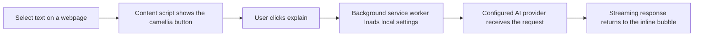

# Jieyuhua - Inline AI Text Explainer for Chrome

Jieyuhua is a lightweight Chrome extension that explains selected webpage text in place. Select text, click the floating camellia button, and get a streaming AI explanation without leaving the page.

[](./LICENSE)
[](https://developer.chrome.com/docs/extensions/develop/migrate/what-is-mv3)
[](#installation)
[](https://developer.mozilla.org/en-US/docs/Web/JavaScript)

## Highlights

- Inline explanation bubble for selected text
- Streaming AI responses directly inside the current webpage
- Follow-up questions without reopening a separate chat app
- Chrome Side Panel for manual chat and model settings
- Built-in presets for OpenAI, DeepSeek, Moonshot/Kimi, Zhipu GLM, Doubao, Qwen, OpenRouter, and Anthropic Claude
- Custom OpenAI-compatible endpoint support
- Local-first configuration with no project-owned backend server
- Plain HTML, CSS, and JavaScript; no bundler or build step required

## How It Works



## Installation

### Install from source

1. Clone or download this repository.
2. Open `chrome://extensions/` in Chrome.
3. Enable `Developer mode`.
4. Click `Load unpacked`.
5. Select the repository folder that contains `manifest.json`.
6. Open the extension Side Panel, choose a provider, enter an API key, and save.

```bash
git clone https://github.com/keer-d/jieyuhua-extension.git
cd jieyuhua-extension
```

## Usage

1. Select text on any webpage.
2. Click the floating camellia button next to the selection.
3. Read the inline streaming explanation.
4. Ask follow-up questions from the same bubble.

You can also use the context menu item: `Explain with Jieyuhua`.

## Provider Presets

| Provider | Base URL | Default model | Format |
| --- | --- | --- | --- |
| OpenAI | `https://api.openai.com/v1` | `gpt-4o-mini` | OpenAI-compatible |
| DeepSeek | `https://api.deepseek.com/v1` | `deepseek-chat` | OpenAI-compatible |
| Moonshot/Kimi | `https://api.moonshot.cn/v1` | `moonshot-v1-8k` | OpenAI-compatible |
| Zhipu GLM | `https://open.bigmodel.cn/api/paas/v4` | `glm-4-plus` | OpenAI-compatible |
| Doubao | `https://ark.cn-beijing.volces.com/api/v3` | `doubao-seed-1-6-251015` | OpenAI-compatible |
| Qwen | `https://dashscope.aliyuncs.com/compatible-mode/v1` | `qwen-plus` | OpenAI-compatible |
| OpenRouter | `https://openrouter.ai/api/v1` | `openai/gpt-4o-mini` | OpenAI-compatible |
| Anthropic | `https://api.anthropic.com/v1` | `claude-3-5-sonnet-20241022` | Anthropic Messages API |

See [Provider Examples](./docs/provider-examples.md) for copy-paste configuration examples.

## Examples

### OpenAI

```text
Provider: OpenAI
Base URL: https://api.openai.com/v1
Model: gpt-4o-mini
API Key: sk-...
```

### OpenRouter

```text
Provider: OpenRouter
Base URL: https://openrouter.ai/api/v1
Model: openai/gpt-4o-mini
API Key: sk-or-...
```

### Custom OpenAI-compatible endpoint

```text
Provider: Custom
Base URL: https://your-endpoint.example.com/v1
Model: your-model-name
API Key: your-api-key
```

Jieyuhua sends OpenAI-compatible chat completion requests to:

```http
POST /chat/completions
Content-Type: application/json
Authorization: Bearer <API_KEY>
```

Example request body:

```json
{
  "model": "gpt-4o-mini",
  "stream": true,
  "messages": [
    {
      "role": "user",
      "content": "Explain this selected text clearly."
    }
  ]
}
```

## Project Structure

```text
.
|-- background.js        # Service worker, context menu, provider streaming
|-- content.js           # Webpage selection UI and inline explanation bubble
|-- sidepanel.html       # Chrome Side Panel UI
|-- sidepanel.css        # Side Panel styling
|-- sidepanel.js         # Side Panel settings and manual chat logic
|-- manifest.json        # Chrome Manifest V3 configuration
|-- icons/               # Extension icons
|-- docs/                # Architecture and provider examples
|-- PRIVACY.md           # Privacy policy
|-- CONTRIBUTING.md      # Contribution guide
`-- DEVELOPMENT.md       # Local development workflow
```

## Permissions

Jieyuhua uses the following Chrome permissions:

- `contextMenus`: adds the selected-text context menu action.
- `storage`: stores provider, model, API key, endpoint, and prompt settings locally.
- `sidePanel`: provides the settings and manual chat interface.
- `host_permissions`: allows requests to configured AI provider endpoints.

The manifest includes `https://*/*` so users can configure custom OpenAI-compatible endpoints. If you only need fixed providers, you can remove that wildcard and keep only the provider domains you use.

## Privacy

Jieyuhua has no project-owned backend server and no analytics script. API keys and settings are stored in the user's local browser storage.

When you ask for an explanation, the selected text, follow-up messages, conversation context, and provider authentication information are sent to the AI provider you configured. Read [PRIVACY.md](./PRIVACY.md) before using the extension with sensitive content.

## Development

No build step is required. Edit the source files, reload the extension in `chrome://extensions/`, and refresh the target webpage.

For debugging, packaging, and contribution workflow, see [DEVELOPMENT.md](./DEVELOPMENT.md).

## Troubleshooting

### The explanation bubble keeps loading

Reload the extension from `chrome://extensions/`, then refresh the webpage. Chrome content scripts continue running until the page is reloaded.

### The API request fails

Check your provider, base URL, model name, API key, and account quota. Some providers require model-specific endpoint IDs.

### The icon does not appear

Make sure the `icons/` folder is present and contains `icon16.png`, `icon48.png`, and `icon128.png`.

## Roadmap

- Optional screenshot/demo section
- Exportable settings backup
- Provider-specific error messages
- Keyboard shortcut support
- Chrome Web Store packaging checklist

## Contributing

Contributions are welcome. Please read [CONTRIBUTING.md](./CONTRIBUTING.md) before opening a pull request.

## License

This project is licensed under the [MIT License](./LICENSE).
