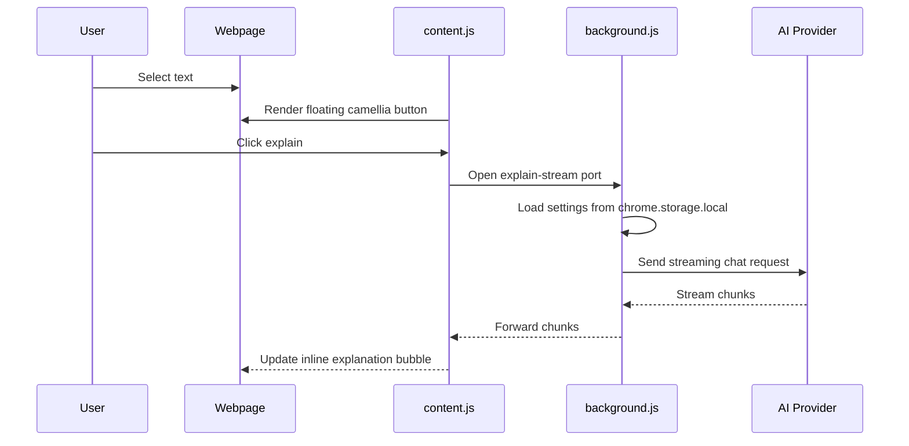

# Architecture

Jieyuhua is split into three Chrome extension surfaces:

- Content script: runs on webpages and owns the inline selection experience.
- Background service worker: owns context menu actions and streaming provider calls for inline bubbles.
- Side Panel: owns settings, manual chat, and provider configuration.

## Runtime Flow



## Storage

Settings are stored with `chrome.storage.local`:

```json
{
  "settings": {
    "provider": "openai",
    "apiKey": "sk-...",
    "model": "gpt-4o-mini",
    "baseUrl": "https://api.openai.com/v1",
    "systemPrompt": "Explain clearly and concisely."
  }
}
```

The project does not store data on a project-owned server.

## Provider Formats

Most providers use the OpenAI-compatible Chat Completions format:

```http
POST /chat/completions
Authorization: Bearer <API_KEY>
Content-Type: application/json
```

Anthropic uses the Messages API:

```http
POST /messages
x-api-key: <API_KEY>
anthropic-version: 2023-06-01
Content-Type: application/json
```

## Design Constraints

- No build step.
- No runtime dependency on npm packages.
- Keep generated UI inside a Shadow DOM where possible.
- Escape model output before rendering lightweight Markdown.
- Keep provider credentials in local browser storage only.
