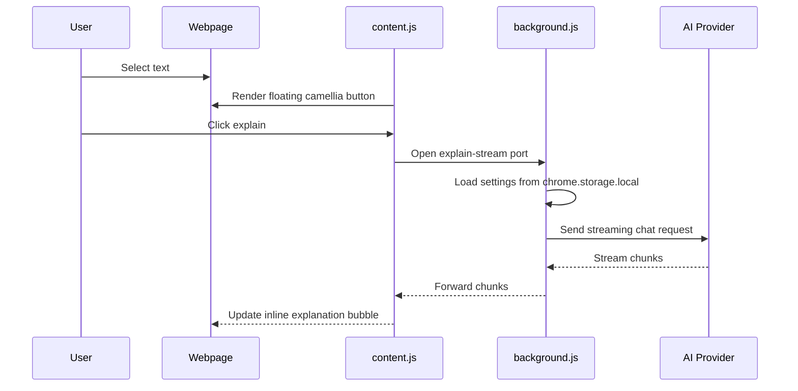

# Architecture

FluentLoop is split into three Chrome extension surfaces:

- Content script: runs on webpages and owns the inline selection experience.
- Background service worker: owns context menu actions and streaming provider calls for inline bubbles.
- Side Panel: owns settings, manual chat, and provider configuration.

## Runtime Flow



## Storage

Settings are stored with `chrome.storage.local`:

```json
{
  "settings": {
    "provider": "openai",
    "apiKey": "sk-...",
    "model": "gpt-4o-mini",
    "baseUrl": "https://api.openai.com/v1",
    "systemPrompt": "Explain clearly and concisely."
  }
}
```

The project does not store data on a project-owned server.

## Provider Formats

Most providers use the OpenAI-compatible Chat Completions format:

```http
POST /chat/completions
Authorization: Bearer <API_KEY>
Content-Type: application/json
```

Anthropic uses the Messages API:

```http
POST /messages
x-api-key: <API_KEY>
anthropic-version: 2023-06-01
Content-Type: application/json
```

## Design Constraints

- No build step.
- No runtime dependency on npm packages.
- Keep generated UI inside a Shadow DOM where possible.
- Escape model output before rendering lightweight Markdown.
- Keep provider credentials in local browser storage only.


## Files (v2.0)

| File | Responsibility |
|---|---|
| `manifest.json` | MV3 manifest. `scripting` + `tabs` are needed to read the current page's article text. |
| `background.js` | Service worker. Owns every network call: streaming chat over a long-lived Port, plus one-shot JSON tasks (`analyze`, `quiz`, `grade`, `summarize`). Also grabs page text and writes cards to the shelf. |
| `content.js` | Selection handling and the inline bubble, inside a Shadow DOM so page CSS cannot reach it. |
| `sidepanel.{html,css,js}` | Four views: chat, shelf, practice, settings. |
| `lib/prompts.js` | Every prompt lives here, and nowhere else. The brevity rules are enforced in `SYSTEM_BASE`. |
| `lib/store.js` | Cards, tag-derived folders, and per-word spaced repetition. No preset taxonomy: folders are computed from tags on read. |
| `lib/md.js` | Shared markdown renderer. Turns `word /ipa/` into a pronounceable chip. Loaded by both the content script and the side panel. |

## Why prompts live in the service worker

The content script never builds a prompt. It sends the raw selected text and a `mode`, and the worker wraps it with the template from `lib/prompts.js`. That is what keeps answers short: brevity is a property of the extension, not something the model is politely asked for once and forgets.

## Spaced repetition

Each word carries `srs: {level, due, seen, wrong}`. Intervals are `[0, 1, 2, 4, 8, 16, 32]` days. A correct answer advances one level; a wrong answer resets to 0 and makes the word due immediately. Level 5 counts as mastered, which is what the camellia petals on the achievement wall are counting.


## v2.1: full-tab study page

Reading and quick questions belong on the page you are reading. Exams and review belong somewhere you go on purpose. So the extension has three surfaces over one store:

- **Inline bubble** (`content.js`) — understand a phrase in place.
- **Side panel** (`sidepanel.*`) — ask a quick question, glance at the shelf, short review.
- **Full-tab studio** (`study.*`, opened at `chrome-extension://<id>/study.html`) — deep reading with six panes (vocab, econ terms, bilingual, cloze, grammar, notes), exams with breathing room, and the achievement wall.

All three read the same `chrome.storage`. No login, no server, no monthly cost. The trade-off is device-local: this Chrome profile only. Export/Import in `store.js` draws the data boundary for the day a real backend is worth paying for — not before.

## Spaced repetition: SM-2

Replaced the earlier level-table scheduler with SM-2 and a four-grade review model. Each word holds `srs: {interval, ef, reps, due, seen, wrong}`.

- Grades: 不会 (0) resets and re-shows in 10 minutes; 难 (3) / 会了 (4) / 简单 (5) advance. A wrong choice in a multiple-choice exam grades as MISS (2) — lighter than a flashcard "forgot".
- Ease factor is adjusted *before* the interval so 难 pushes nearer than 会了 on the same press, not one review later.
- The first two steps are graded too (1/2/4 then 4/6/9 days), so the four buttons never show three identical dates — each button prints the real interval that press will schedule.
- Interval ≥ 21 days counts as mastered; that is what the camellia petals count.
- v2 data (`level`/`due`) migrates to SM-2 on first read.
